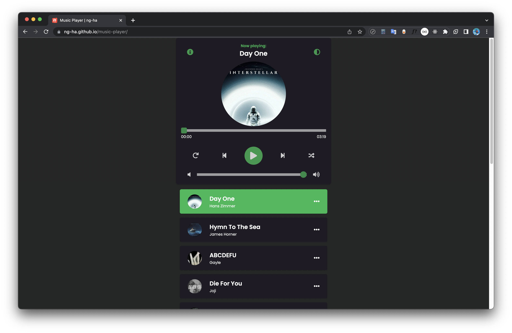
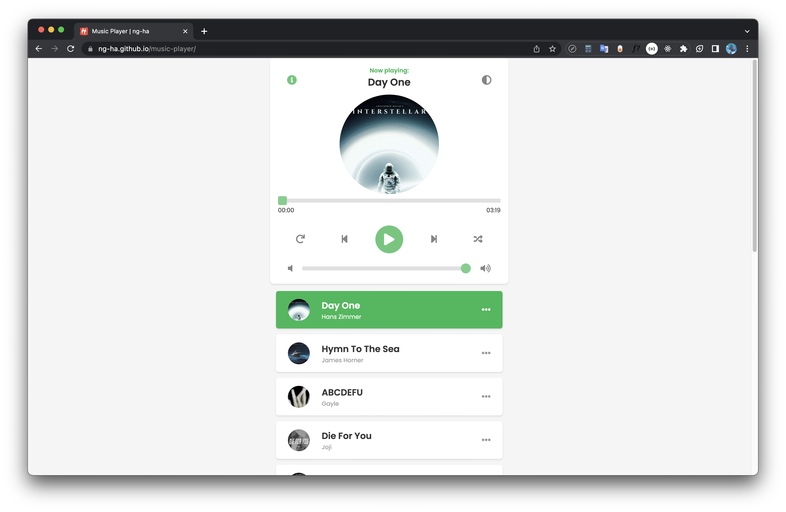

# Music Player written in Vanilla JS :headphones:

### Link Demo 📌

[https://ng-ha.github.io/music-player/](https://ng-ha.github.io/music-player/)

### Features :computer:

- Render songs
- Scroll Top
- Play/Pause/Seek
- CD rotate
- Next/Prev
- Random
- Next/Prev when ended
- Active song
- Scroll active song into view
- Play song when click
- Dark mode

### Technologies ✨

- Vanilla Javascript
- HTML/CSS

### License :right_anger_bubble:

[MIT](https://choosealicense.com/licenses/mit/)
